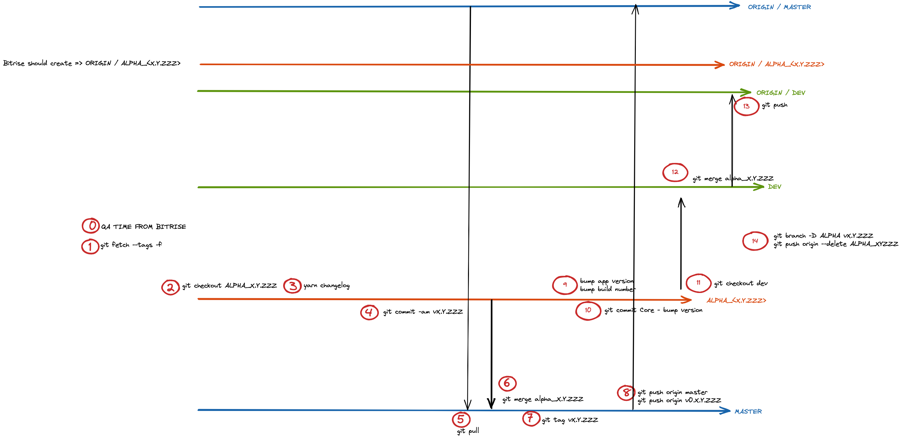

# @getluko/mobile-release-process

Scripts to automate git flow used by our mobile team when releasing. usefull for release and patch.



The `mobile-release-process release` command will:

- Ask you several questions to be sure that you can start the release
- Check the next app version number
- Prepare the branch to release a alpha or a patch
- Trigger build on Bitrise
- Prepare the next release
- Clean up all temporary branch

## Configuration

1. Install the package:

```
yarn add @getluko/mobile-release-process --dev
```

2. create a configuration file at root `.mobile-release-process.config.json`

```js
{
  "infoPlist": "./ios/<project_name>/Info.plist", // mandatory, path to the Info.plist file
  "buildGradle": "./android/app/build.gradle", // mandatory, path to the build.gradle file
  "git": {
    "alphaBranch": "alpha", // optional (default: alpha)
    "devBranch": "dev", // optional (default: dev)
    "masterBranch": "master", // optional (default: master)
    "releaseBranch": "release", // optional (default: release)
    "stagingBranch": "staging" // optional (default: staging)
  },
  // Use during the script execution to output shortcut link in the terminal
  "releaseCILink": "https://app.bitrise.io/app/xxxxxxxxxx", // optional (default: undefined)
  "releaseTrackingLink": "https://www.notion.so/xxxx/xxxxx", // optional (default: undefined)
  "playConsole": "https://play.google.com/console/xxxxx", // optional (default: undefined)
  "testflight": "https://appstoreconnect.apple.com/xxxxx" // optional (default: undefined)
}
```

3. Command

Release a new version of the app (new alpha), will bump by 10 the version number and buildNumber

```
npx mobile-release-process release
```

Release a patch for the current app in alpha, will bump by 1 the version number and buildNumber

```
npx mobile-release-process alpha-patch
```

Prepare the next alpha branch, we use this script with bitrise to build the next release in alpha

```
npx mobile-release-process create-alpha-branch
```

bump the version number by 1 or 10

```
npx mobile-release-process build-version-script
```

bump the build number by 1 or 10

```
npx mobile-release-process build-version-script
```
